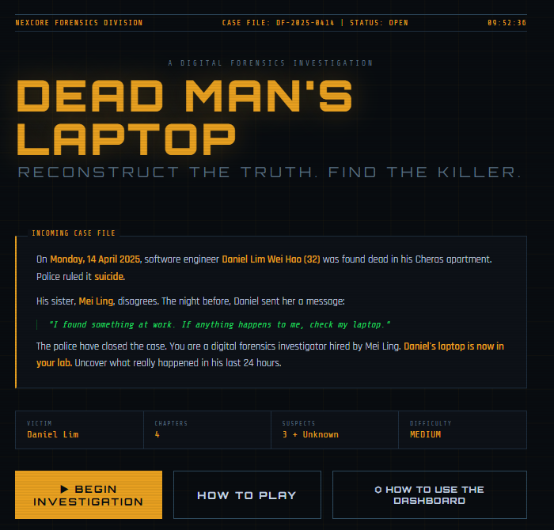
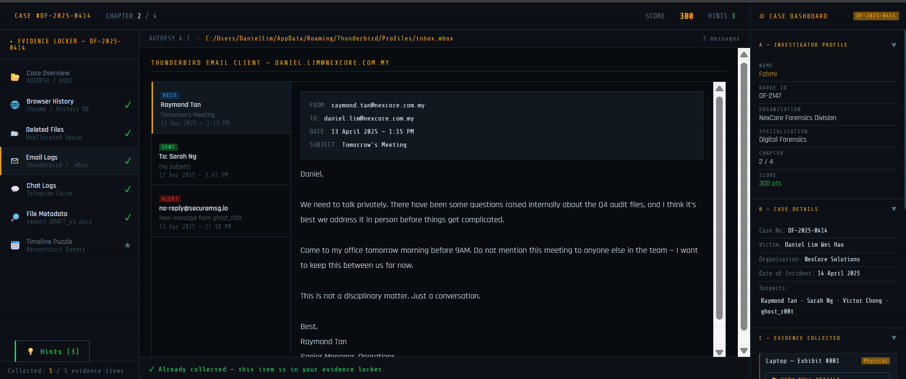
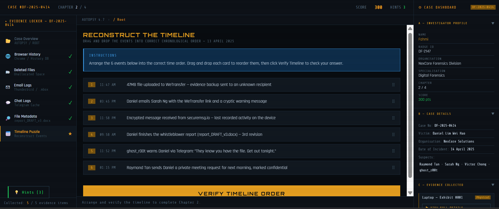

# 🔍 Dead Man's Laptop
### A Digital Forensic Investigation Game

> **CCSB5223 Computer Forensics | Assignment 2 | Group 7**  
> College of Computing & Informatics, Universiti Tenaga Nasional (UNITEN)  
> Semester 2, 2025/2026



---

## 📋 Table of Contents

- [Overview](#overview)
- [Case Background](#case-background)
- [Game Features](#game-features)
- [Gameplay Walkthrough](#gameplay-walkthrough)
- [Forensic Concepts Covered](#forensic-concepts-covered)
- [Screenshots](#screenshots)
- [Tech Stack](#tech-stack)
- [How to Run](#how-to-run)
- [Team](#team)

---

## Overview

**Dead Man's Laptop** is an interactive browser-based digital forensic investigation game developed for the CCSB5223 Computer Forensics course. Players assume the role of a forensic investigator tasked with uncovering the truth behind a suspected whistleblower homicide case in Malaysia.

The game simulates a complete forensic investigation pipeline — from evidence intake to court-admissible report writing — using realistic tools, artefacts, and Malaysian legal frameworks.

| Attribute | Details |
|-----------|---------|
| Case Number | DF-2025-0414 |
| Victim | Daniel Lim Wei Hao, 32 |
| Chapters | 4 |
| Suspects | 3 Named + 1 Unknown |
| Difficulty | Medium |
| Platform | Web Browser (HTML/CSS/JS) |

---

## Case Background

On **14 April 2025**, software engineer **Daniel Lim Wei Hao** was found dead in his Cheras apartment. PDRM ruled the death a suicide and closed the case within 48 hours.

The night before his death, Daniel sent his sister a final message:

> *"I found something at work. If anything happens to me, check my laptop."*

His sister, **Lim Mei Ling**, privately engaged NexCore Forensics Division for an independent investigation. Daniel's **ASUS VivoBook 15** (Serial: NX-DL-9347-2025) is now in the investigator's lab.

### Key Persons

| Role | Name | Significance |
|------|------|-------------|
| Victim | Daniel Lim Wei Hao | Software Engineer at NexCore Solutions |
| Suspect | Victor Chong | CEO of NexCore Solutions |
| Suspect | Raymond Tan | Senior Manager of NexCore Solutions |
| Suspect | Sarah Ng | Daniel's colleague |
| Anonymous Contact | `ghost_r00t` | Anonymous who warned Daniel |

---

## 🎮 Game Features

| Feature | Description |
|---------|-------------|
| 🔗 Chain of Custody Simulation | Form validation cross-referenced against investigator profile |
| 🖥️ Simulated Autopsy 4.7 Interface | Evidence Locker sidebar, file path breadcrumbs, forensic concept panels |
| 🧩 Drag-and-drop Timeline Puzzle | Reconstruct 6 events in chronological order |
| 🕵️ Suspect Board | Link evidence tags to 4 suspects with score rewards/deductions |
| 🔓 Base64 Cipher Analysis | Built-in decoder tool to reveal `ghost_r00t`'s identity |
| 📦 Archive Password Recovery | Contextual deduction to unlock `encrypted_backup.zip` |
| 📄 Court-Admissible Report Writing | 5-section Digital Forensic Report submitted to PDRM & MACC |
| 🏆 Scoring System | Points awarded/deducted per action; graded final score (Grade S = 855+ pts) |
| 📊 Persistent Case Dashboard | Live-updating investigator profile, evidence list, and tools panel |

---

## Gameplay Walkthrough

```
Main Menu / Case Brief
        │
        ▼
Chapter 1 — Secure the Evidence
  ├── Complete Chain of Custody Form
  ├── Select Forensic Imaging Tool (FTK Imager)
  └── Verify MD5 Hash
        │
        ▼
Chapter 2 — The Last 24 Hours
  ├── Evidence 1: Browser History (Chrome History DB)
  ├── Evidence 2: Deleted Files (File Carving / Autopsy)
  ├── Evidence 3: Email Logs (Thunderbird .mbox)
  ├── Evidence 4: Chat Logs (Telegram tdata cache)
  ├── Evidence 5: File Metadata (DOCX XML)
  └── Timeline Reconstruction Puzzle (drag-and-drop)
        │
        ▼
Chapter 3 — Connect the Dots
  ├── Build Suspect Board (link evidence to suspects)
  ├── Decode Base64 cipher
  └── Unlock encrypted_backup.zip
        │
        ▼
Chapter 4 — The Verdict
  ├── Complete 5-section Digital Forensic Report
  └── Submit to PDRM Cybercrime Division & MACC
        │
        ▼
Case Closed
```

---

## Forensic Concepts Covered

| Concept | Chapter | Tools Simulated |
|---------|---------|----------------|
| Chain of Custody | 1 | Manual form with field validation |
| Forensic Drive Imaging | 1 | FTK Imager, MD5 hash verification |
| Browser Artefact Analysis | 2 | Chrome History DB |
| File Carving | 2 | Autopsy 4.7 (PhotoRec module) |
| Email Forensics | 2 | Thunderbird `.mbox` format |
| Chat Forensics | 2 | Telegram `tdata` cache recovery |
| Metadata Analysis | 2 | DOCX XML — `Last Modified By` field |
| Evidence Correlation | 3 | Suspect Board |
| Cipher Analysis (Base64) | 3 | Built-in `atob()` decoder |
| Contextual Password Recovery | 3 | Clue deduction from email history |
| Court-Admissible Reporting | 4 | 5-section forensic report form |
| Legal & Ethical Standards | 4 | Malaysian law references |

### Malaysian Legal Frameworks Referenced
- Digital Signature Act 1997
- Computer Crimes Act 1997
- MACC Act 2009
- Whistleblower Protection Act 2010

---

## 📸 Screenshots

| Main Menu | Autopsy Interface |
|:---------:|:-----------------:|
|  |  |

| Suspect Board |
|:-------------:|
|  |

---

## Tech Stack

```
HTML5      — Game structure, forms, evidence panels, report sections
CSS3       — Dark forensic terminal theme, amber/cyan colour scheme, responsive layout
JavaScript — Game logic, form validation, scoring, drag-and-drop, Base64 decoding (atob())
```

The game runs as a **single-file web application** (`index.html`) — no installation or server required.

**Tested on:** Chrome · Firefox · Edge

---

## How to Run

```bash
# Clone the repository
git clone https://github.com/fahmi910/Dead-s-Man-Laptop.git

# Navigate into the project folder
cd dead-mans-laptop

# Open the game directly in your browser
open index.html
```

> No dependencies. No build step. Just open `index.html` in any modern browser.

---

## Team

| No. | Name | Student ID |
|-----|------|-----------|
| 1 | Muhammad Arshad bin Sathar Mohamed | CS01083702 |
| 2 | Muhammad Fahmi bin Abd Salim | CS01083703 |
| 3 | Muhammad Hakim bin Mohd Hanifah | CS01083704 |
| 4 | Muhamad Amirul bin Mohd Hamidi | CS01083697 |

**Course:** CCSB5223 Computer Forensics (Section 01BT)  
**Prepared for:** Dr Iznora Aini binti Zolkifly  
**Institution:** Universiti Tenaga Nasional (UNITEN)

---

<div align="center">

*"I found something at work. If anything happens to me, check my laptop."*  
— Daniel Lim Wei Hao

</div>
